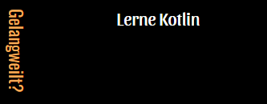
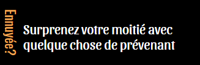

# MMM-Bored
Gives you ideas when you're bored for MagicMirror

# INSTRUCTIONS
   
# ~MagicMirror/modules
 git clone https://github.com/cowboysdude/MMM-Bored
  
# ~MagicMirror/modules/MMM-Bored
 npm install
 
 NO API KEYS needed.

Currently supports 11 languages.   If you want to use your own language message me on the MagicMirror Forum!

        
